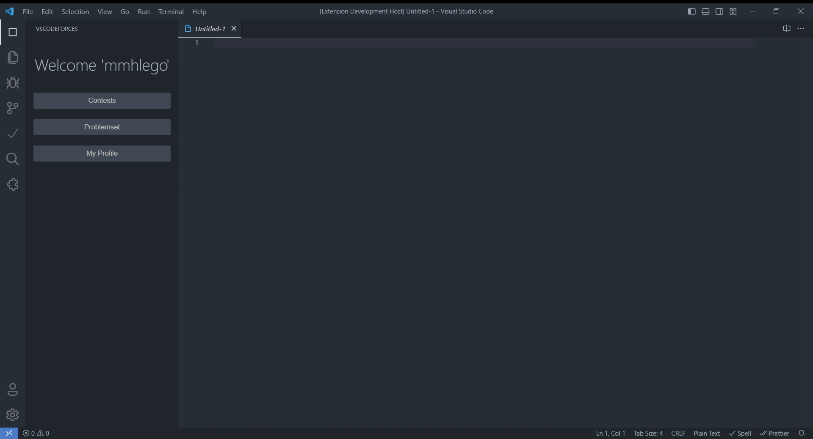

# VsCodeforces: Codeforces for VScode

This extension provides full access to codeforces website via its apis.

## Functionalities

This extension provides a variety of functionalities based on the codeforces website and its api. Some of the functionalities are listed as below:

### View and Filter contests

You can view list of all contests and filter them base on one of these factors:

- **Type**: Every contest has a type which is equal to one of the following values:
  - **ICPC**: Refers to [International Collegiate Programming Contest](https://icpc.global/) Mirrors.
  - **IOI**: Refers to [International Olympiad in Informatics](https://ioinformatics.org/) Mirrors.
  - **CF**: Refers to codeforces standard contests such as Educational Rounds, Welcome Rounds and etc.
  - **Any**: Selects all of the types above.
- **Phase**: Every contest has one of the following phases based on its duration and start date:
  - **Before**: Contests that haven't began.
  - **Running**: Contests that are currently running.
  - **Finished**: Contests that are finished.
- **Name**: You can also search contests by name. For example you can search 'Educational Round' and the result page contains all the educational rounds.

### View and Filter problemset

This extension also enables the ability to browse and filter problems based on different parameter like:

- **Name**: All problems have a unique name and you can search it.
- **Type**: Every problem is either 'PROGRAMMING' or 'QUESTION' type.
- **Rating**: Each problems difficulty usually is defined by a value in range of 800 to 3500 which 800 is the easiest and 3500 is the hardest. This field is also visible as a color bar on the left side of the problem as shown below.
- **Tags**: Also each problem contains some tags that describe the fields that are required for solving that problem.

_NOTE: Problemset filter is currently being implemented and tested. Thus the video below doesn't contain filter fields._

### View contests and its information

Upon clicking on a contest, the contest information panel will open which displays all the information about the contest including duration, problems, solves, rating and many more.

### View problem and solve it

When clicking on a problem in the problemset list or any place, you are able to see the problem prompt and test cases within the vs code and start solving it with your preferred language and template. Also after solving the problem you can submit an view submission result with this extension.

### View and Manage profile

You can view and manage your codeforces profile via the extension without needing to open in it browser. Also you can view your latest submissions, rating graph, friends and etc.

## Contribute

If you like to help improving this extension, take a look at `/app/` directory for all the UI implementations and `/src/` for interacting with vscodes api. Also for more information take a look at [CONTRIBUTING.md](./CONTRIBUTING.md) for more information.

Also special thanks to [Hacker0limbo](https://github.com/hacker0limbo) for their boilerplate.

## License

Copyright (c) 2023, Mohammad Mahdi Hejazi

All rights reserved.

This source code is licensed under the MIT license found in the
LICENSE file in the root directory of this source tree. 
